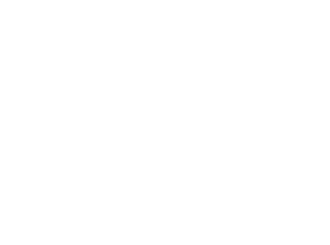
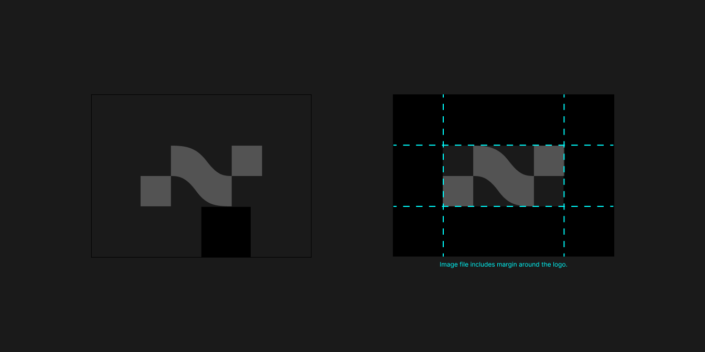

# Nimbus

Last Updated: November 1, 2022 1:31 PM
version: v0

 

# Brand Marks

### Choosing the right mark

Our mark is the primary brand element on our own properties, such as our websites and products. Here it can stand on its own. A simple bold mark can make a powerful statement. When our brand is represented in other contexts, throughout the web or in products we do not own, it is usually best to use a lockup. Finally, we have created lockups for use in small applications, where simply shrinking down will make the features illegible. Only use these lockups (the name includes the prefix ‘small’) for sizes below 40px.

Please do not edit, change, distort, recolor, or reconfigure the Nimbus mark. Our mark is the primary brand element on our own properties, such as our websites and products.

 

## Primary Mark

|  |  |
| -------------------------------------------------------------------- | -------------------------------------------------------------------- |
| Nimbus primary mark - black                                          | Nimbus primary mark - white                                          |
| [marks-Nimbus-Large-Black.png](nimbus/marks-Nimbus-Large-Black.png)  | [marks-Nimbus-Large-White.png](nimbus/marks-Nimbus-Large-White.png)  |
| [marks-nimbus-large-black.svg](nimbus/marks-nimbus-large-black.svg)  | [marks-nimbus-large-white.svg](nimbus/marks-nimbus-large-white.svg)  |

 

---

 

## Lockup - Vertical

When we represent our brand throughout the web or in products we do not own, it is usually best to use a lockup. These horizontal lockups are best used arranged horizontally in a line.

|  |  |
| ------------------------------------------------------------------------------------------------ | ------------------------------------------------------------------------------------------------ |
| Nimbus lockup mark - vertical - black                                                            | Nimbus lockup mark - vertical - white                                                            |
| [vertical_lockups-nimbus-large-black.svg](nimbus/vertical_lockups-nimbus-large-black.svg)        | [vertical_lockups-nimbus-large-white.svg](nimbus/vertical_lockups-nimbus-large-white.svg)        |
| [Vertical-Nimbus-Large-Black.png](nimbus/Vertical-Nimbus-Large-Black.png)                        | [Vertical-Nimbus-Large-White.png](nimbus/Vertical-Nimbus-Large-White.png)                        |

 

---

 

## Lockup - Horizontal

When we represent our brand throughout the web or in products we do not own, it is usually best to use a lockup. These horizontal lockups are best used stacked vertically.

|   |   |
| ------------------------------------------------------------------------------------------------------------- | ------------------------------------------------------------------------------------------------------------- |
| Nimbus lockup mark - horizontal - black                                                                       | Nimbus lockup mark - horizontal - white                                                                       |
| [horizontal-Nimbus-Default-Large-Black.png](nimbus/horizontal-Nimbus-Default-Large-Black.png)                 | [horizontal-Nimbus-Default-Large-White.png](nimbus/horizontal-Nimbus-Default-Large-White.png)                 |
| [horizontal_lockups-nimbus-default-large-black.svg](nimbus/horizontal_lockups-nimbus-default-large-black.svg) | [horizontal_lockups-nimbus-default-large-white.svg](nimbus/horizontal_lockups-nimbus-default-large-white.svg) |

 

---

 

### Clearspace

When placing the logo, it's important that it's given enough space from other elements on the surface it's presented on. The Clearspace is 50% of the width of the Nimbus mark. This Clearspace is accounted for as a margin in all our logo assets, so simply mind the edges of the image.

If you need to define the unit of space, the best way is to measure the bottom of any given mark to the edge of the image or the baseline of the logotype in the lockup to the bottom edge of the image. This unit is the same across all of our marks.

 

### Co-Branding

Often, our brand marks will be used as a family or in different combinations. All of our marks and lockups are designed to work together. The two major rules here are the consistency of size and the consistency of style.

Hierarchy is determined by the placement order, the most important being left in the case of horizontal layouts, or top in the vertical case. Vertical lockups are used in horizontal layouts and horizontal lockups in vertical layouts.

- All marks should be the same size
- Priority is determined by order, not scale
- All marks should be the same style
- Do not mix lockups and non-lockups
- Do not mix vertical lockups with horizontal lockups

 

---

 

# Social Assets

Our asset library will be more robust in the future, but the images below are branded avatars social accounts, followed by a preview of how they will look on Twitter.

|     |              |
| ------------------------------------------------------------- | ------------------------------------------------------------------------------- |
| Nimbus primary avatar                                         | Nimbus primary banner                                                           |
| [twitter-avatar-nimbus.svg](nimbus/twitter-avatar-nimbus.svg) | [Banner-Nimbus-Twitter-1600x800.png](nimbus/Banner-Nimbus-Twitter-1600x800.png) |
| [twitter-avatar-nimbus.png](nimbus/twitter-avatar-nimbus.png) |

 

---

 

# Presentation Template

Copy and save as a new presentation with a new title if you plan to make one from the template.
Also, make sure to check the Layout pull-down for all the placeholder goodies.

[Nimbus Presentation Template MAKE A COPY](https://docs.google.com/presentation/d/1extQeoMdbY2VZbTZH0sNKOM0AGMzpXjGsq9eG44zWjo/edit?usp=drivesdk)
